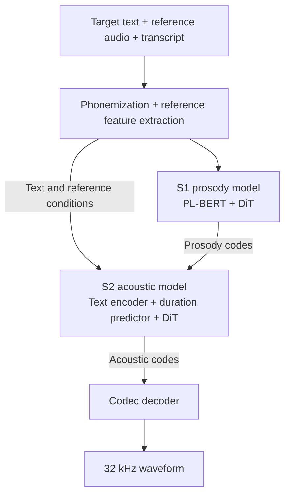

# Architecture

PL-Flow is a two-stage, reference-conditioned speech synthesis model. S1 and S2
both use DiT flow matching.

## Inference

Inputs: target text, reference audio and its transcript. Output: 32 kHz mono audio.
S1 generates phoneme-level prosody codes. S2 combines text and prosody, predicts
phoneme durations, expands the conditions to frames, and generates acoustic codes.
The Codec decoder turns those codes into a waveform.

Reference feature extraction has three branches:

- **HuBERT → Aligner → phoneme pooling + prosody encoder:** reference prosody codes.
- **WavLM/ECAPA:** speaker embedding.
- **Codec encoder:** reference acoustic codes.

## Training

| Module | Training task |
| --- | --- |
| Aligner | Learn audio–phoneme alignment from HuBERT features and transcripts. |
| Codec | Encode, quantize and reconstruct audio, using spectral reconstruction and GAN losses. |
| S2 | Learn acoustic-code generation and duration prediction from text, prosody and speaker embeddings; optionally train the prosody encoder jointly. |
| S1 | Learn target prosody-code generation from text, reference prosody and speaker embeddings. |

From scratch: train the Aligner and Codec independently → extract alignments,
acoustic codes and speaker embeddings → train S2 jointly with its prosody encoder
→ freeze the prosody encoder and extract prosody codes → train S1.

S2 can also train on pre-extracted prosody codes with a frozen prosody encoder.
HuBERT, PL-BERT and the speaker encoder stay frozen throughout training.
