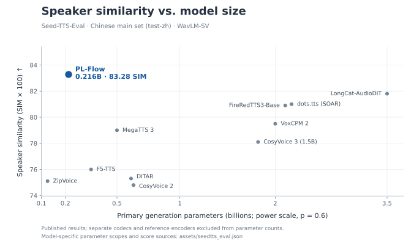

<h1 align="center">PL-Flow</h1>

<p align="center">
  <a href="https://github.com/rcell233/pl-flow"></a>
  <a href="https://huggingface.co/rcell233/pl-flow/tree/main"></a>
  <a href="LICENSE"></a>
</p>

PL-Flow is a two-stage, reference-conditioned text-to-speech model that produces
32 kHz mono audio. See [Architecture](ARCHITECTURE.md) for the model structure.

The PL-Flow application uses [GPL-3.0-only](LICENSE).
Component licenses and notices are listed in [THIRD_PARTY.md](THIRD_PARTY.md).

## Seed-TTS-Eval

**215.6M generation parameters · 83.28 speaker similarity on test-zh.**



WER/CER are percentages (lower is better); SIM is WavLM-SV cosine similarity × 100
(higher is better). The average gives equal weight to the three splits.

| Model | Params | test-en WER↓ / SIM↑ | test-zh CER↓ / SIM↑ | test-zh-hard CER↓ / SIM↑ | Avg error↓ / SIM↑ |
| --- | ---: | ---: | ---: | ---: | ---: |
| **PL-Flow** | 0.216B | 1.96 / **79.0** | 1.25 / **83.3** | **5.25** / **82.4** | **2.82** / **81.5** |
| [ZipVoice](https://arxiv.org/html/2506.13053v2#S2.T1) | 0.123B | 1.70 / 69.7 | 1.40 / 75.1 | — | — |
| [F5-TTS](https://github.com/studio-dots-ai/dots.tts#seed-tts-eval) | 0.336B | 2.00 / 67.0 | 1.53 / 76.0 | 8.67 / 71.3 | 4.07 / 71.4 |
| [MegaTTS 3](https://github.com/studio-dots-ai/dots.tts#seed-tts-eval) | 0.5B | 2.79 / 77.1 | 1.52 / 79.0 | — | — |
| [DiTAR](https://github.com/studio-dots-ai/dots.tts#seed-tts-eval) | 0.6B | 1.69 / 73.5 | 1.02 / 75.3 | — | — |
| [CosyVoice 2](https://github.com/meituan-longcat/LongCat-AudioDiT#experimental-results-on-seed-benchmark) | 0.618B | 2.57 / 65.2 | 1.45 / 74.8 | 6.83 / 72.4 | 3.62 / 70.8 |
| [CosyVoice 3 (1.5B)](https://github.com/studio-dots-ai/dots.tts#seed-tts-eval) | 1.8B | 2.22 / 72.0 | 1.12 / 78.1 | 5.83 / 75.8 | 3.06 / 75.3 |
| [VoxCPM 2](https://github.com/studio-dots-ai/dots.tts#seed-tts-eval) | 2B | 1.84 / 75.3 | 0.97 / 79.5 | 8.13 / 75.3 | 3.65 / 76.7 |
| [FireRedTTS3-Base](https://github.com/FireRedTeam/FireRedTTS3#zero-shot-voice-cloning--seed-tts-eval) | 2.121B | 1.64 / 77.2 | 1.01 / 80.9 | 6.50 / 78.4 | 3.05 / 78.8 |
| [dots.tts (SOAR)](https://github.com/studio-dots-ai/dots.tts#seed-tts-eval) | 2.198B | **1.30** / 77.1 | **0.94** / 81.0 | 6.60 / 79.5 | 2.95 / 79.2 |
| [LongCat-AudioDiT](https://github.com/meituan-longcat/LongCat-AudioDiT#experimental-results-on-seed-benchmark) | 3.5B | 1.50 / 78.6 | 1.09 / 81.8 | 6.04 / 79.7 | 2.88 / 80.0 |
| Ground truth (GT) | — | 2.14 / 73.4 | 1.25 / 75.5 | — | — |

Parameters cover the primary generation network: S1 + S2 + PL-BERT for PL-Flow.
Separate codecs and reference feature encoders are excluded; model-specific scopes
and score sources are in [benchmark data](assets/seedtts_eval.json).
Other models' scores come from the linked reports.
GT uses original target recordings; its SIM compares them with the paired reference recordings.

PL-Flow: 1,088 / 2,020 / 400 utterances; EMA weights; S1 8 steps / CFG 2.1,
S2 10 steps / CFG 2.8; seed 1237, batch size 8. Sampling settings were selected on
subsets of test-zh and test-zh-hard.

## Training summary

S1, S2, the aligner and codec were trained from random initialization on a
**single RTX 5090 D (32 GB)**. Pretrained feature encoders remain frozen.

| Stage | Steps | Batch | Approx. training time |
| --- | ---: | ---: | ---: |
| Aligner | 420K | 16 | ~39 h |
| SQ codec (32-dim, 50 Hz) | 250K | 8 | ~22 h |
| S1 (prosody flow) | 400K | ≤128 | ~44 h |
| S2 (acoustic flow + duration) | 1,000K | 16 | ~54 h |
| **Total** | **2.07M** | | **~159 h** |

Times cover active training, excluding data preparation and pauses.
S1 and S2 use EMA weights (decay 0.9999).

The S1/S2 corpus contains **5,066 hours / 2.03M utterances**: 2,336 h Chinese,
1,923 h English and 807 h Japanese.

## Install

Tested with Python 3.10, PyTorch 2.8 and TorchAudio 2.8. Install PyTorch and
TorchAudio for your CUDA version first; CPU inference is also supported.

```bash
pip install -c constraints.txt .
```

Install `espeak-ng` through your OS package manager for English pronunciation fallback.
Language resources may download on first use.

## Models and inference

Download the model bundle from [Hugging Face](https://huggingface.co/rcell233/pl-flow/tree/main):

```bash
hf download rcell233/pl-flow --local-dir artifacts/pretrained
```

Download the speaker checkpoint
[wavlm_large_finetune.pth](https://drive.google.com/file/d/1-aE1NfzpRCLxA4GUxX9ITI3F9LlbtEGP/view)
from [Seed-TTS-Eval](https://github.com/BytedanceSpeech/seed-tts-eval#metrics)
to `artifacts/pretrained/speaker/wavlm_large_finetune.pth`.

Use a short reference recording and its accurate transcript:

```bash
pl-flow synthesize --models artifacts/pretrained \
  --reference-audio data/reference.wav --reference-text '这是参考音频的准确文本。' \
  --text '你好，欢迎使用语音合成。' --language zh --output outputs/example.wav
```

Or use Python:

```python
from pl_flow.inference.pipeline import Synthesizer

with Synthesizer("artifacts/pretrained", device="cuda") as tts:
    waveform = tts.synthesize(
        "Hello, world!", "data/reference.wav", "This is my reference recording.",
        language="en", seed=1237,
    )  # CPU tensor [1, samples], 32000 Hz
```

Alignment and speaker feature extraction run automatically.
For CPU inference, use `--device cpu` or `device="cpu"`.
See `pl-flow synthesize --help` for more options.

## Test-set inference

Download and extract the [Seed-TTS-Eval dataset](https://github.com/BytedanceSpeech/seed-tts-eval#dataset),
then run the [inference script](src/pl_flow/cli/seedtts.py):

```bash
pl-flow seedtts --models artifacts/pretrained \
  --dataset /path/to/seedtts_testset --output outputs/seedtts \
  --seed 1237 --batch-size 8
```

This generates `test-en`, `test-zh` and `test-zh-hard` using the bundle defaults.
Each directory contains `<utterance_id>.wav` and a `meta.lst` for the
[official WER/SIM scorers](https://github.com/BytedanceSpeech/seed-tts-eval#code).
Use `--split test-zh` for one split, `--resume` to continue, or `--limit 8` for a quick check.

## Acknowledgements

This implementation incorporates or builds on:

- [Seed-VC](https://github.com/Plachtaa/seed-vc): flow/DiT foundation.
- [gpt-fast](https://github.com/meta-pytorch/gpt-fast): transformer implementation.
- [VITS](https://github.com/jaywalnut310/vits) and [Matcha-TTS](https://github.com/shivammehta25/Matcha-TTS): text/convolutional blocks and alignment foundations.
- [MQTTS](https://github.com/b04901014/MQTTS): alignment attention and positional-bias layers.
- [Stable Audio Tools](https://github.com/Stability-AI/stable-audio-tools), [EnCodec](https://github.com/facebookresearch/encodec), and [auraloss](https://github.com/csteinmetz1/auraloss): codec, discriminator and spectral-loss building blocks.
- [Music2Latent](https://github.com/SonyCSLParis/music2latent): architectural reference for the STFT codec.
- [Kokoro](https://github.com/hexgrad/kokoro), [Misaki](https://github.com/hexgrad/misaki), [PL-BERT](https://github.com/yl4579/PL-BERT), and [LangSegment](https://github.com/juntaosun/LangSegment): text and phoneme processing.
- [Chinese HuBERT](https://huggingface.co/TencentGameMate/chinese-hubert-base), [WavLM](https://github.com/microsoft/unilm/tree/master/wavlm), [s3prl](https://github.com/s3prl/s3prl), [UniSpeech](https://github.com/microsoft/UniSpeech), and [Seed-TTS-Eval](https://github.com/BytedanceSpeech/seed-tts-eval): semantic/speaker features and pretrained speaker assets.
